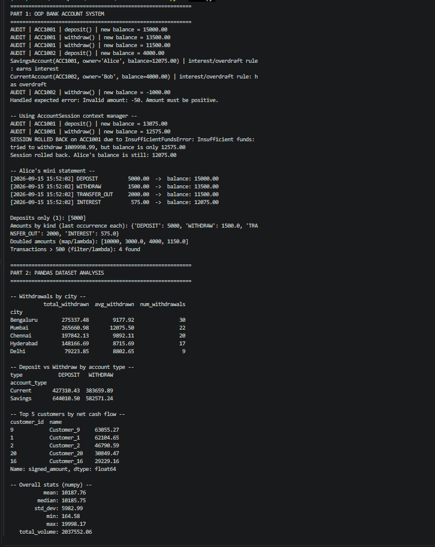

# OOP Bank Account + Pandas Dataset Analysis

This is my mini project — I built a small banking system using
Object-Oriented Programming, and paired it with a pandas + numpy analysis
of a sample transactions dataset.

The idea was to combine everything from this week's topics into one project
instead of doing them separately: OOP (classes, inheritance, polymorphism),
decorators, context managers, custom exceptions, comprehensions/lambda/map/filter,
and pandas + numpy.

## What I built

### 1. The banking system (`bank/`)

I started with a base `BankAccount` class that handles deposits, withdrawals,
and keeps a transaction history. Then I made two account types that inherit
from it but behave differently:

- **SavingsAccount** — earns interest, but only allows a few free withdrawals
  per period before charging a small fee (this is where I used polymorphism —
  `withdraw()` behaves differently here than in the base class)
- **CurrentAccount** — no interest, but allows the balance to go negative up
  to an overdraft limit

Other things I added:
- A `@log_transaction` **decorator** that prints an audit line every time
  money moves, so I didn't have to repeat the same print statement in every method
- An `AccountSession` **context manager** — if you run a batch of operations
  inside a `with` block and one of them fails, everything in that batch gets
  rolled back instead of leaving the account half-updated
- Custom exceptions (`InsufficientFundsError`, `InvalidAmountError`,
  `AccountFrozenError`) instead of just raising generic errors everywhere,
  so I could catch exactly what went wrong

### 2. The pandas analysis (`analysis/`, `data/`)

I generated a small synthetic dataset (`customers.csv` and `transactions.csv`)
and then used pandas to answer a few questions I'd actually want to know as
a bank:

- Which city has the highest total withdrawals?
- How does deposit vs. withdrawal volume compare between Savings and Current
  accounts?
- Who are the top 5 customers by net cash flow (deposits minus withdrawals)?
- Basic stats on transaction amounts (mean, median, std dev) using numpy

I used `merge()` to join the transactions with customer info, `groupby()` for
the summaries, and `np.where()` to build a signed amount column (positive for
deposits, negative for withdrawals) without writing a manual loop.

## How to run it

```bash
python -m venv venv
venv\Scripts\activate      # on Windows
# source venv/bin/activate   # on Mac/Linux
pip install -r requirements.txt
python main.py
```

If you want fresh random data instead of the CSVs already in `data/`:
```bash
python data/generate_data.py
```

## Project structure

```
oop-bank-pandas/
├── bank/
│   ├── __init__.py
│   ├── accounts.py        # BankAccount, SavingsAccount, CurrentAccount
│   ├── transaction.py     # Transaction, @log_transaction, AccountSession
│   └── exceptions.py      # custom exceptions
├── analysis/
│   └── pandas_analysis.py # read_csv, merge, groupby, numpy stats
├── data/
│   ├── generate_data.py
│   ├── customers.csv
│   └── transactions.csv
├── main.py
└── requirements.txt
```

## Output

Here's the program running end to end — Part 1 is the OOP bank system,
Part 2 is the pandas analysis:
 

